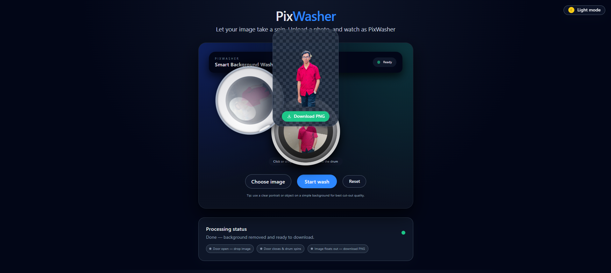

# PixWasher 🖼️✨  
**Smart Background Removal Web Application**

PixWasher is a modern, AI-powered web application that removes image backgrounds with a single click.  
Designed with a clean, interactive UI and a smooth step-by-step workflow, PixWasher delivers fast and high-quality cut-outs suitable for personal, academic, and professional use.

---

## 🚀 Overview

PixWasher allows users to upload an image, process it through an intelligent background removal system, and download the final result as a transparent PNG.  
The interface is inspired by a “washing machine” concept to visually represent the image processing stages.

---

## 🔄 Application Workflow

The full process of PixWasher can be understood through the following steps:

---

### 1️⃣ Upload Image (Initial State)
- User uploads an image using the **Choose image** button.
- The system remains in **Ready** state until an image is selected.
- Clear UI hints guide the user for best input quality.

  

  <em>Initial interface showing image upload and ready state</em>

---

### 2️⃣ Start Processing (Background Removal)
- After the image is loaded, the **Start wash** button becomes active.
- The application processes the image using background removal logic.
- Visual feedback indicates that the “wash” is in progress.

  

  <em>Image loaded and background removal process initiated</em>

---

### 3️⃣ Download Result (Final Output)
- Once processing is complete, the background-removed image is displayed.
- User can download the final image as a **transparent PNG**.
- Processing status updates clearly show completion.

  

  <em>Final output with transparent background and download option</em>

---

## ✨ Key Features

- 🧠 Smart background removal  
- 🖱️ One-click processing  
- 🎨 Clean, modern, dark-themed UI  
- 📷 High-quality transparent PNG output  
- 🔄 Clear step-by-step processing feedback  
- 💡 User-friendly interaction and status indicators  

---

## 🛠️ Technology Stack

- **Backend:** Django (Python)  
- **Image Processing:** Computer Vision–based background removal  
- **Frontend:** HTML, CSS, JavaScript  
- **UI Styling:** Modern component-based design  
- **Output Format:** PNG with transparent background  

---

## 🎯 Use Cases

- Profile picture background removal  
- Academic & research demos  
- Portfolio image preparation  
- Quick object cut-outs for design tasks  

---

## 🔒 Source Code Availability

> **Note:**  
> The source code for PixWasher is private and not publicly available.  
> This repository is intended **for documentation, demonstration, and portfolio purposes only**.

---

## 📩 Contact

For collaboration, demo access, or research discussion:

**Author:** Shantanu Kundu  
**Email:** santanuk745@gmail.com  
**Field:** Web Development · Computer Vision · Applied AI  

---

⭐ If you find PixWasher interesting, feel free to reach out!
